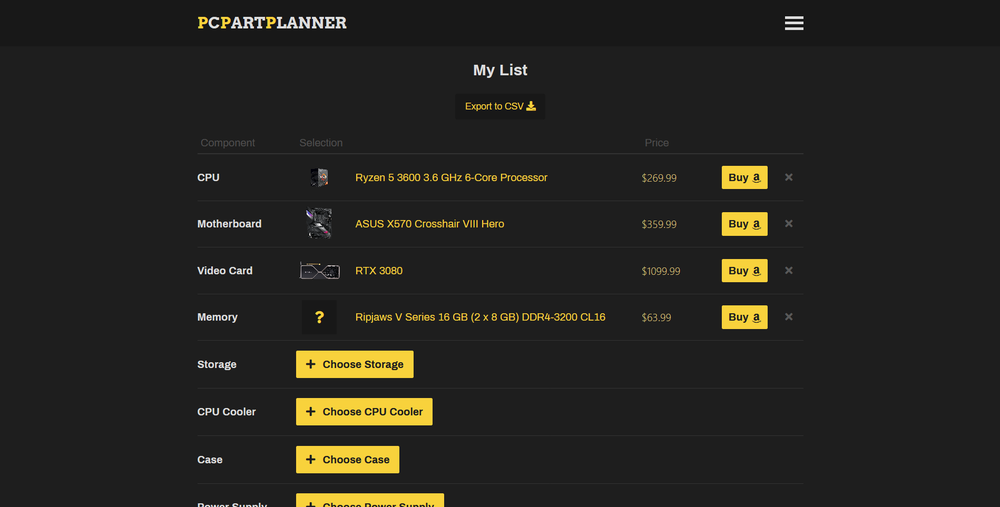
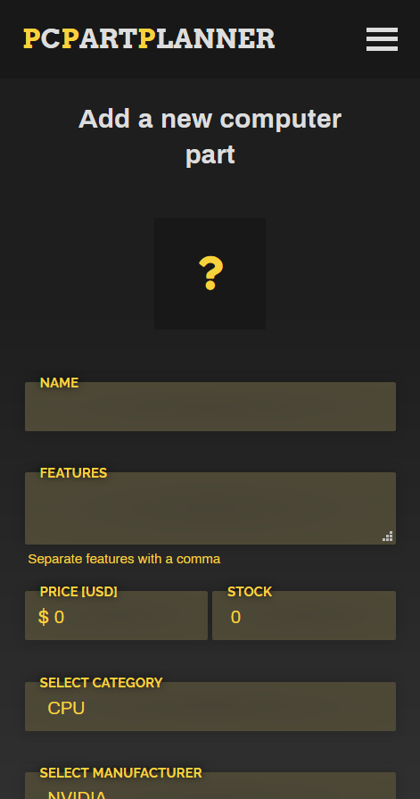

PC Part Planner
====================== 
Created using Express.js and MongoDB

[PC Part Planner](https://pcpartplanner.herokuapp.com/list) allows users to add PC parts, manufacturers, and categories, and allows them to add these parts to their list to plan out a potential build. The total dollar amount is displayed, links are provided to purchase these parts, and a download link to export the list to CSV is provided.

  

<strong>Back-end:</strong> Node.js/Express

<strong>Database:</strong> MongoDB

<strong>Storage:</strong> Cookies

<strong>Front-end:</strong> EJS, HTML, CSS

--------------------------

Mobile-First Responsive Design

  

